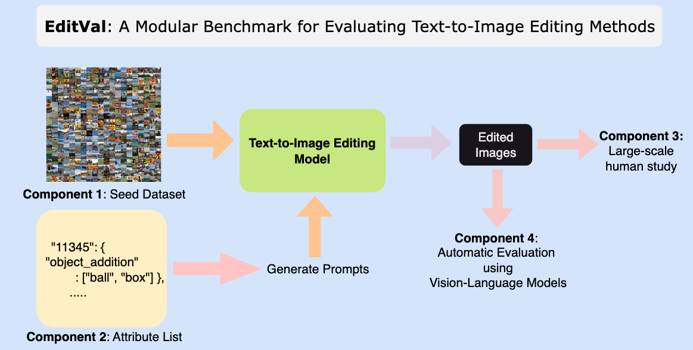

## Overview

**EDITVAL** is a standardized benchmark for evaluating text-guided image editing methods across diverse edit types, validated through a large-scale human study. 


<br/>



**EDITVAL** consists of the following distinct components:

*   A seed dataset _D_ consisting of carefully selected images from **MS-COCO**. These are the real
images which need to be edited by the different editing methods.
*   An attribute list _A_ which consists of various dimensions in which the edits need to be made on the dataset _D_.
*   An evaluation template and procedure for human study on the edited images.
*   An automated evaluation procedure to check quality of edits using pre-trained vision-language models for a subset of attributes in _A_. 


The attribute list _A_ for ~100 images from MS-COCO can be downloaded from [here](https://drive.google.com/file/d/1PJW7mZnrMAtSJC6yG4g4xIHlu3kwIjm5/view){:target="_blank" rel="noopener"}. The format of the json file is as follows:

```
{
  "class_name" : {
    "image_id": { # image ids from MS-COCO
      "edit_attribute" : {
        "from" : ["initial state of attribute"],
        "to" : ["target states of attribute", ...]}}}
}
```

## More Details on EditVal Dataset and Pipeline :
EditVal benchmark contains 648 unique image-edit operations for 19 classes selected from MS-COCO spanning a variety of real-world edits. Edit operations span simple attribute categories like adding or replacing an object to more complex ones such as changing an action, camera viewpoint or replacing the position of an existing object.

The complete list of edit attributes for evaluation currently is:


*   **Object Addition:** adding an object to the image.
*   **Object Replacement:** replacing an existing object in the image with another object.
*   **Size:** changing the size of an object.
*   **Position Replacement:** changing the position of an object in the image (e.g., left, center, right).
*   **Positional Addition:** adding an object in a specific position in the image.
*   **Alter Parts:** modifying the details of an object.
*   **Background:** changing the background of the image.
*   **Texture:** changing the texture of an object (e.g., wooden table, polka dot cat).
*   **Color:** changing the color of an object.
*   **Shape:** changing shape of an object (e.g., circle-shaped stop sign)
*   **Action:** changing the action that the main object is performing (e.g., dog running).
*   **Viewpoint:** changing the viewpoint in which the image is taken from (e.g., photo of a dog from above).


<div id="human_study"></div>

# MTurk Human Study

The template to run an [MTurk study](https://requester.mturk.com/){:target="_blank" rel="noopener"} to evaluate the quality of the image editting methods is provided [here](https://drive.google.com/file/d/1r5zzuJy8WXIABhTcTZHXNtWUdWKO9yC-/view?usp=sharing){:target="_blank" rel="noopener"}. 

Together with the template, an input csv file must be provided for the mturk study. Each row of the csv file represents one instance of edit, which contains these four inputs:

*   url_org: url of the original image.
*   url_edit: url of the editted image.
*   prompt: the prompt used to edit the image.
*   class_name: name of the main object in the image.

An example of an input csv file can be seen [here](https://drive.google.com/file/d/1Zf923hlC6mw1F8Gxbajx7Nx8dibwEhTl/view?usp=sharing){:target="_blank" rel="noopener"}. Below is an example of how the mturk study looks to the workers.

<div style="background-color:rgba(34, 139, 34, 0.5);border-radius: 25px;padding:10px;font-size:12px;width:100%;">
  <div style="display:flex;">
      <div style="float:left;padding:5px;">
        
      </div>
      <div style="float:left;padding:5px;">
            
      </div>
  </div>
  <div>
    <p>The right image is supposed to apply the prompt "Change apple to orange" to the left image.</p>
  </div>
  <div style="padding-bottom:20px">
    <p><b>How well is the edit from the given prompt applied?</b></p>
      <input type="radio" id="q1_0" name="q1" disabled/>
      <label for="q1_0" style="padding-right:10px" disabled>Not applied</label>
      <input type="radio" id="q1_1" name="q1" disabled/>
      <label for="q1_1" style="padding-right:10px" disabled>Minorly applied</label>
      <input type="radio" id="q1_2" name="q1" disabled/>
      <label for="q1_2" style="padding-right:10px" disabled>Adequetly applied</label>
      <input type="radio" id="q1_3" name="q1" checked="checked"/>
      <label for="q1_3" style="padding-right:10px">Perfectly applied</label>
  </div>
  <div style="padding-bottom:20px">
    <p><b>How well are the other properties (other than what the edit is targeting) of the main object (apple) preserved in the right image?</b></p>
      <input type="radio" id="q2_0" name="q2" disabled/>
      <label for="q2_0" style="padding-right:10px" disabled>Object is completely changed</label>
      <input type="radio" id="q2_1" name="q2" disabled/>
      <label for="q2_1" style="padding-right:10px" disabled>Some parts are preserved</label>
      <input type="radio" id="q2_2" name="q2" disabled/>
      <label for="q2_2" style="padding-right:10px" disabled>Most parts are preserved</label>
      <input type="radio" id="q2_3" name="q2" checked="checked"/>
      <label for="q2_3" style="padding-right:10px">Other properties of the object are perfectly preserved</label>
  </div>
  <div>
    <p><b>How well are the other properties (other than what the edit is targeting) of the main object (apple) preserved in the right image?</b></p>
      <input type="radio" id="q3_0" name="q3" disabled/>
      <label for="q3_0" style="padding-right:10px" disabled>Completely changed</label>
      <input type="radio" id="q3_1" name="q3" disabled/>
      <label for="q3_1" style="padding-right:10px" disabled>Some parts are preserved</label>
      <input type="radio" id="q3_2" name="q3" checked="checked"/>
      <label for="q3_2" style="padding-right:10px">Most parts are preserved</label>
      <input type="radio" id="q3_3" name="q3" disabled/>
      <label for="q3_3" style="padding-right:10px" disabled>Perfectly preserved</label>
  </div>
</div>


<div id="leaderboards"></div>

# Leaderboards


<table id="myTable">
  <tr>
   <!--When a header is clicked, run the sortTable function, with a parameter, 0 for sorting by names, 1 for sorting by country:-->  
    <th onclick="sortTable(0)">Method</th>
    <th onclick="sortTable(1)">Country</th>
    <th onclick="sortTable(2)">Country</th>
    <th onclick="sortTable(3)">Country</th>
    <th onclick="sortTable(4)">Country</th>
    <th onclick="sortTable(5)">Country</th>
  </tr>
</table>


<div id="contact"></div>

# Contact Us


<script>
function sortTable(n) {
  var table, rows, switching, i, x, y, shouldSwitch, dir, switchcount = 0;
  table = document.getElementById("myTable");
  switching = true;
  //Set the sorting direction to ascending:
  dir = "asc"; 
  /*Make a loop that will continue until
  no switching has been done:*/
  while (switching) {
    //start by saying: no switching is done:
    switching = false;
    rows = table.rows;
    /*Loop through all table rows (except the
    first, which contains table headers):*/
    for (i = 1; i < (rows.length - 1); i++) {
      //start by saying there should be no switching:
      shouldSwitch = false;
      /*Get the two elements you want to compare,
      one from current row and one from the next:*/
      x = rows[i].getElementsByTagName("TD")[n];
      y = rows[i + 1].getElementsByTagName("TD")[n];
      /*check if the two rows should switch place,
      based on the direction, asc or desc:*/
      if (dir == "asc") {
        if (x.innerHTML.toLowerCase() > y.innerHTML.toLowerCase()) {
          //if so, mark as a switch and break the loop:
          shouldSwitch= true;
          break;
        }
      } else if (dir == "desc") {
        if (x.innerHTML.toLowerCase() < y.innerHTML.toLowerCase()) {
          //if so, mark as a switch and break the loop:
          shouldSwitch = true;
          break;
        }
      }
    }
    if (shouldSwitch) {
      /*If a switch has been marked, make the switch
      and mark that a switch has been done:*/
      rows[i].parentNode.insertBefore(rows[i + 1], rows[i]);
      switching = true;
      //Each time a switch is done, increase this count by 1:
      switchcount ++;      
    } else {
      /*If no switching has been done AND the direction is "asc",
      set the direction to "desc" and run the while loop again.*/
      if (switchcount == 0 && dir == "asc") {
        dir = "desc";
        switching = true;
      }
    }
  }
}
</script>
<script src="http://ajax.googleapis.com/ajax/libs/jquery/1.7.1/jquery.min.js"></script>
<script src="https://cdnjs.cloudflare.com/ajax/libs/PapaParse/4.1.2/papaparse.js"></script>

<script>
    function arrayToTable(tableData) {
        var table = document.getElementById("myTable");
        $(tableData).each(function (i, rowData) {
            let row = table.insertRow(-1);
            $(rowData).each(function (j, cellData) {
                let c = row.insertCell(j);
                c.innerText = cellData;
            });
        });
        return table;
    }

    $.ajax({
        type: "GET",
        url: "http://127.0.0.1:4000/sample.csv",
        success: function (data) {
            arrayToTable(Papa.parse(data).data);
        }
    });
</script>

